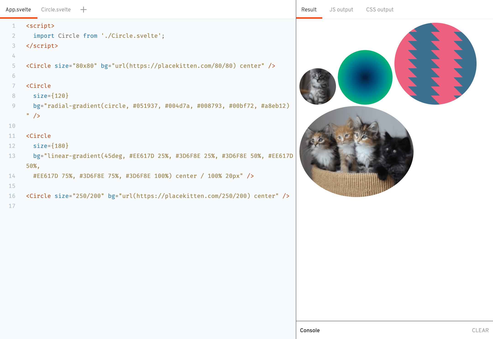

# `svelte-css-vars`

> Ever wanted to have reactive css variables in svelte? What if I told you there's a way?

`svelte-css-vars` exposes a [svelte action](https://svelte.dev/docs#use_action) which receives an object of properties that should be treated as css custom properties. By defining this object inside a `$:{}` reactive block, `svelte-css-vars` can update those css properties on the fly whenever some of its values change.

## Usage

`import cssVars from 'svelte-css-vars';`

After importing the module, just define the reactive object of your custom properties:

```js
let some_state_variable = true;

$: styleVars = {
  titleColor: some_state_variable ? 'red' : 'blue',
};
```

And then use the action, passing the object, on the desired element:

```html
<style>
  div {
    color: var(--titleColor);
  }
</style>

<div use:cssVars="{styleVars}">
  <!-- anything here will have access to var(--titleColor) -->
</div>
```

## Example

[](https://svelte.dev/repl/1522fe3bdf904843a01101d9f900241d)

[REPL](https://svelte.dev/repl/1522fe3bdf904843a01101d9f900241d)
